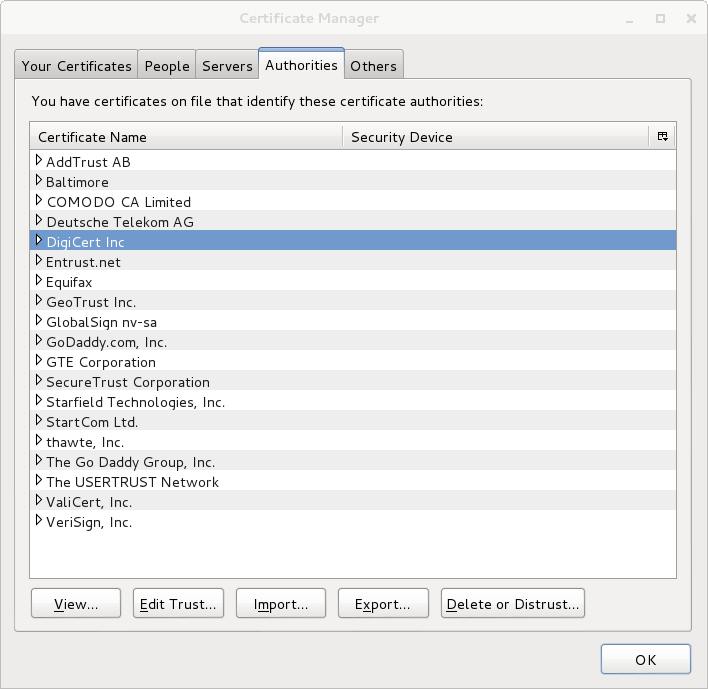

Firefox hardening
=================

What's all this then?
---------------------

This is a [user.js][1] configuration file for Mozilla Firefox that's supposed to harden Firefox's settings and make it more secure.

### Main goals

* Limit the possibilities to track the user through [web analytics](https://en.wikipedia.org/wiki/Web_analytics)
* Harden the browser, so it doesn't spill it's guts when asked (have you seen what [BeEF](http://beefproject.com/) can do?)
* Limit the browser from storing anything even remotely sensitive persistently (mostly just making sure [private browsing][8] is always on)
* Make sure the browser doesn't reveal too much information to [shoulder surfers](https://en.wikipedia.org/wiki/Shoulder_surfing_%28computer_security%29)
* Harden the browser's encryption (cipher suites, protocols, trusted CAs)
* Hopefully limit the attack surface by disabling various features
* Still be usable in daily use

### How to achieve this?

There are several parts to all this and they are:

* Running a selected list of browser extensions
* Using the user.js settings file itself
* Using the **cas.sh** script to limit the CAs

How to use the user.js file
---------------------------

Just drop the [user.js][1] file to your Firefox profile directory at ````~/.mozilla/firefox/XXXXXXXX.your_profile_name```` and verify that the settings are effective from [about:support](http://kb.mozillazine.org/Troubleshooting_Information_report#Modified_Preferences) (check the "Important Modified Preferences" and "user.js Preferences" sections).

If you want to be able to keep your [user.js][1] up-to-date with this repository, you can clone the latter in the main mozilla directory and create a link to the [user.js][1] file from your profile:
````
cd ~/.mozilla/firefox
git clone 'https://github.com/pyllyukko/user.js.git'
cd XXXXXXXX.your_profile_name
ln -s ../user.js/user.js user.js
````

Do note that these settings alter your browser behaviour quite a bit, so it is recommended to either create a completely new [profile][15] for Firefox or backup your existing profile directory before putting the ```user.js``` file in place.

Whenever you want to update your local copy of the repository, just use ````git pull```` and restart Firefox.

### Android

On [Firefox for Android](https://www.mozilla.org/en-US/firefox/android/) (Fennec), you need to drop the file to ```/data/data/org.mozilla.firefox/files/mozilla/XXXXXXXX.your_profile_name```. If you use Jolla and run Firefox through Alien Dalvik, the location needs to be prefixed with ```/opt/alien```.

See [issue #14](https://github.com/pyllyukko/user.js/issues/14) for further details on using this ```user.js``` file with Firefox for Android.

### Windows

On Windows, you need to drop the ```user.js``` file to ```%appdata%\Mozilla\Firefox\Profiles\XXXXXXXX.your_profile_name```.

What does it do?
----------------

There's a whole lot of settings that this modifies and they are divided in the following sections or categories:

* HTML5 / [APIs](https://wiki.mozilla.org/WebAPI) / DOM
* Miscellaneous
* Extensions / plugins related
* Firefox (anti-)[features](https://en.wikipedia.org/wiki/Feature_creep) / components
* [Automatic connections](https://support.mozilla.org/en-US/kb/how-stop-firefox-making-automatic-connections)
* HTTP protocol related
* Caching
* UI related
* TLS / HTTPS / OCSP related
* Cipher suites

Some of the settings in this [user.js][1] file might seem redundant, as some of them are already set to the same values by default. However, the [user.js][1] file has this nice property, that even if you go change any of these settings through [about:config][6], they're reset to the [user.js][1] defined values after you restart Firefox. So [user.js][1] makes sure they're back at the secure default values always when you start your browser. That way, it also makes experimenting with different settings easier.

Here are some of the "highlights" from each category. For a full list of settings and references, check the ```user.js``` file itself.

### HTML5 / APIs / DOM

* Disable [geolocation](https://www.mozilla.org/en-US/firefox/geolocation/)
* Don't reveal internal [IP addresses](http://net.ipcalf.com/) ([media.peerconnection.enabled](https://blog.mozilla.org/futurereleases/2013/01/12/capture-local-camera-and-microphone-streams-with-getusermedia-now-enabled-in-firefox/))
  * [BeEF Module: Get Internal IP WebRTC](https://github.com/beefproject/beef/wiki/Module%3A-Get-Internal-IP-WebRTC)
* [browser.send_pings](http://kb.mozillazine.org/Browser.send_pings)
* Disable [WebGL](https://en.wikipedia.org/wiki/WebGL)
* Disable [Battery API](http://mashable.com/2015/08/04/battery-privacy-html5/)

### Miscellaneous

* Enables Firefox's [mixed content blocking](https://blog.mozilla.org/tanvi/2013/04/10/mixed-content-blocking-enabled-in-firefox-23/) (also for "display" content)
* Disables various your-browser-knows-better-let-me-guess-what-you-were-trying features
  * Disable this [keyword thingie](http://kb.mozillazine.org/Keyword.enabled)
  * Disable [Domain Guessing](http://www-archive.mozilla.org/docs/end-user/domain-guessing.html)

### Extensions / plugins related

It is common for [client side attacks](https://www.offensive-security.com/metasploit-unleashed/client-side-attacks/) to target [browser extensions][14], instead of the browser itself (just look at all those [Java](https://en.wikipedia.org/wiki/Criticism_of_Java#Security) and [Flash](http://www.cvedetails.com/vulnerability-list/vendor_id-53/product_id-6761/Adobe-Flash-Player.html) vulnerabilities). Make sure your extensions and plugins are always up-to-date.

* Disable flash
* Enable [click to play](https://wiki.mozilla.org/Firefox/Click_To_Play)
* Enable [add-on updates](https://blog.mozilla.org/addons/how-to-turn-off-add-on-updates/)

### Firefox features

* Enables Firefox's built-in [tracking protection][12]
* Disables [telemetry](https://wiki.mozilla.org/Telemetry), [Crash Reporter](https://support.mozilla.org/en-US/kb/Mozilla%20Crash%20Reporter), [healt report](https://support.mozilla.org/en-US/kb/firefox-health-report-understand-your-browser-perf), [heartbeat](https://wiki.mozilla.org/Advocacy/heartbeat) and other such privacy invading nonsense

### Automatic connections

This section disables some of Firefox's [automatic connections](https://support.mozilla.org/en-US/kb/how-stop-firefox-making-automatic-connections).

* Disables prefetching
  * [network.prefetch-next](http://kb.mozillazine.org/Network.prefetch-next)
  * [network.dns.disablePrefetch](http://kb.mozillazine.org/Network.dns.disablePrefetch)
* Disable [Necko](https://wiki.mozilla.org/Privacy/Reviews/Necko)/predictor
* Disable [search suggestions](http://kb.mozillazine.org/Browser.search.suggest.enabled)

Do note, that some automatic connections are still intentionally left out (as in not disabled), namely the following:

* [browser.safebrowsing.malware.enabled](http://kb.mozillazine.org/Browser.safebrowsing.malware.enabled)
* [plugins.update.notifyUser](https://wiki.mozilla.org/Firefox3.6/Plugin_Update_Awareness_Security_Review)
* ```extensions.update.enabled```
* [extensions.blocklist.enabled](http://kb.mozillazine.org/Extensions.blocklist.enabled)

See also [#20](https://github.com/pyllyukko/user.js/issues/20).

### HTTP

* Referer header:
  * Spoofs the referer header with [network.http.referer.spoofSource][9] & [Network.http.sendRefererHeader](http://kb.mozillazine.org/Network.http.sendRefererHeader#1)
  * "[Don't send the Referer header when navigating from a https site to another https site.](http://kb.mozillazine.org/Network.http.sendSecureXSiteReferrer#false)"
* Don't accept [3rd party cookies](http://kb.mozillazine.org/Network.cookie.cookieBehavior#1)

### Caching

* Permanently enables [private browsing][8] mode
* Prevents Firefox from storing data filled in web page forms
* Disables [password manager](https://support.mozilla.org/en-US/kb/Remembering+passwords)

### UI related

* Don't [suggest any URLs](http://kb.mozillazine.org/Browser.urlbar.maxRichResults) while typing at the address bar

### TLS / HTTPS / OCSP related

* TLS v1.[012] only
* Require [OCSP](https://en.wikipedia.org/wiki/Online_Certificate_Status_Protocol)
  * Notice that this setting has some [privacy implications](https://en.wikipedia.org/wiki/Online_Certificate_Status_Protocol#Privacy_concerns)
* [OCSP stapling](https://blog.mozilla.org/security/2013/07/29/ocsp-stapling-in-firefox/) (enabled by default anyway)
* Disable [TLS session tickets](https://www.blackhat.com/us-13/archives.html#NextGen)
* Enforces [pinning](https://wiki.mozilla.org/SecurityEngineering/Public_Key_Pinning)


### Ciphers

This section tweaks the cipher suites used by Firefox. The idea is to support only the strongest ones with emphasis on [forward secrecy](https://en.wikipedia.org/wiki/Forward_secrecy), but without compromising compatibility with all those sites on the internet. As new crypto related flaws are discovered quite often, the cipher suites can be [tweaked to mitigate these newly discovered threats](https://github.com/pyllyukko/user.js/pull/18).

Here's a list of the ciphers with default config and Firefox 27.0.1:

	Cipher Suites (23 suites)
	    Cipher Suite: TLS_ECDHE_ECDSA_WITH_AES_128_GCM_SHA256 (0xc02b)
	    Cipher Suite: TLS_ECDHE_RSA_WITH_AES_128_GCM_SHA256 (0xc02f)
	    Cipher Suite: TLS_ECDHE_ECDSA_WITH_AES_256_CBC_SHA (0xc00a)
	    Cipher Suite: TLS_ECDHE_ECDSA_WITH_AES_128_CBC_SHA (0xc009)
	    Cipher Suite: TLS_ECDHE_RSA_WITH_AES_128_CBC_SHA (0xc013)
	    Cipher Suite: TLS_ECDHE_RSA_WITH_AES_256_CBC_SHA (0xc014)
	    Cipher Suite: TLS_ECDHE_RSA_WITH_3DES_EDE_CBC_SHA (0xc012)
	    Cipher Suite: TLS_ECDHE_ECDSA_WITH_RC4_128_SHA (0xc007)
	    Cipher Suite: TLS_ECDHE_RSA_WITH_RC4_128_SHA (0xc011)
	    Cipher Suite: TLS_DHE_RSA_WITH_AES_128_CBC_SHA (0x0033)
	    Cipher Suite: TLS_DHE_DSS_WITH_AES_128_CBC_SHA (0x0032)
	    Cipher Suite: TLS_DHE_RSA_WITH_CAMELLIA_128_CBC_SHA (0x0045)
	    Cipher Suite: TLS_DHE_RSA_WITH_AES_256_CBC_SHA (0x0039)
	    Cipher Suite: TLS_DHE_DSS_WITH_AES_256_CBC_SHA (0x0038)
	    Cipher Suite: TLS_DHE_RSA_WITH_CAMELLIA_256_CBC_SHA (0x0088)
	    Cipher Suite: TLS_DHE_RSA_WITH_3DES_EDE_CBC_SHA (0x0016)
	    Cipher Suite: TLS_RSA_WITH_AES_128_CBC_SHA (0x002f)
	    Cipher Suite: TLS_RSA_WITH_CAMELLIA_128_CBC_SHA (0x0041)
	    Cipher Suite: TLS_RSA_WITH_AES_256_CBC_SHA (0x0035)
	    Cipher Suite: TLS_RSA_WITH_CAMELLIA_256_CBC_SHA (0x0084)
	    Cipher Suite: TLS_RSA_WITH_3DES_EDE_CBC_SHA (0x000a)
	    Cipher Suite: TLS_RSA_WITH_RC4_128_SHA (0x0005)
	    Cipher Suite: TLS_RSA_WITH_RC4_128_MD5 (0x0004)

Here's the list with this config:

	Cipher Suites (8 suites)
	    Cipher Suite: TLS_ECDHE_ECDSA_WITH_AES_128_GCM_SHA256 (0xc02b)
	    Cipher Suite: TLS_ECDHE_RSA_WITH_AES_128_GCM_SHA256 (0xc02f)
	    Cipher Suite: TLS_ECDHE_ECDSA_WITH_AES_256_CBC_SHA (0xc00a)
	    Cipher Suite: TLS_ECDHE_RSA_WITH_AES_256_CBC_SHA (0xc014)
	    Cipher Suite: TLS_RSA_WITH_AES_128_CBC_SHA (0x002f)
	    Cipher Suite: TLS_RSA_WITH_AES_256_CBC_SHA (0x0035)


This is not enough!
-------------------

Here's some other tips how you can further harden Firefox:

* Keep your browser updated! If you check [Firefox's security advisories][10], you'll see that pretty much every new version of Firefox contains some security updates. If you don't keep your browser updated, you've already lost the game.
* Disable all unnecessary extensions and plugins!
* Create different [profiles][15] for different purposes

### Add-ons

Here is a list of the most essential security and privacy enhancing add-ons that you should consider using:

* [Certificate Patrol][4]
  * I recommend setting the 'Store certificates even when in [Private Browsing][8] Mode' to get full benefit out of certpatrol, even though it stores information about the sites you visit
* [HTTPS Everywhere](https://www.eff.org/https-everywhere)
* [NoScript](http://noscript.net/)
* [DuckDuckGo Plus](https://addons.mozilla.org/en-US/firefox/addon/duckduckgo-for-firefox/) (instead of Google)

#### Tracking protection

Tracking protection is one of the most important technologies that you need. The usual recommendation has been to run the [Ghostery](https://www.ghostery.com/) extension, but as it is made by a [potentially evim(tm) advertising company](https://en.wikipedia.org/wiki/Ghostery#Criticism), some people feel that is not to be trusted. One notable alternative is to use [uBlock](https://github.com/gorhill/uBlock), which can also be found at [Mozilla AMO](https://addons.mozilla.org/en-US/firefox/addon/ublock-origin/).

Ghostery is still viable option, but be sure to disable the [GhostRank](https://www.ghostery.com/en/faq#q5-general) feature.

Do note, that this user.js also enables Mozilla's built-in [tracking protection][12], but as that's quite new feature it is to be considered only as a fallback and not a complete solution. As it utilizes [Disconnect's list](https://support.mozilla.org/en-US/kb/tracking-protection-firefox#w_what-is-tracking-protection), recommending Disconnect seems redundant.

So to summarize, pick one between Ghostery and uBlock, depending on your personal preferences.

See also:
* [Mozilla Lightbeam][13] extension
* [Privacy Badger](https://www.eff.org/privacybadger) extension from EFF (also to be considered as an additional security measure and not a complete solution)
* [Web Browser Addons](https://prism-break.org/en/subcategories/gnu-linux-web-browser-addons/) section in [PRISM break](https://prism-break.org/)
* [\[Talk\] Ghostery Vs. Disconnect.me Vs. uBlock #16](https://github.com/pyllyukko/user.js/issues/16)
* [Ghostery sneaks in new promotional messaging system #47](https://github.com/pyllyukko/user.js/issues/47)
* [Are We Private Yet?](http://www.areweprivateyet.com/) site (made by Ghostery)
* [Tracking Protection in Firefox For Privacy and Performance](https://kontaxis.github.io/trackingprotectionfirefox/#papers) paper

#### Add-ons for mobile platforms

* [NoScript Anywhere](https://noscript.net/nsa/)
* [uBlock](https://addons.mozilla.org/en-US/android/addon/ublock-origin/)
* [HTTPS Everywhere](https://www.eff.org/https-everywhere)

Online tests
------------

* [Panopticlick](https://panopticlick.eff.org/)
* [www.filldisk.com](http://www.filldisk.com/)
* [SSL Client Test](https://www.ssllabs.com/ssltest/viewMyClient.html)
* [evercookie](http://samy.pl/evercookie/)
* [Mozilla Plugin Check][14]
* [BrowserSpy.dk](http://browserspy.dk/)
* [Testing mixed content](https://people.mozilla.org/~tvyas/mixedcontent.html)
  * [Similar from Microsoft](https://ie.microsoft.com/testdrive/browser/mixedcontent/assets/woodgrove.htm)
* [WebRTC stuff](http://mozilla.github.io/webrtc-landing/)
* [Flash player version](https://www.adobe.com/software/flash/about/) from Adobe
* [Verify your installed Java Version](https://www.java.com/en/download/installed.jsp)
  * Protip: Don't use Oracle's Java!! But if you really need it, update it regulary!
* [IP check](http://ip-check.info/?lang=en)
* [Onion test for CORS and WebSocket](http://cure53.de/leak/onion.php)
* [Firefox Addon Detector](http://thehackerblog.com/addon_scanner/)
  * [Blog post](http://thehackerblog.com/dirty-browser-enumeration-tricks-using-chrome-and-about-to-detect-firefox-plugins/)
* [browserrecon](http://www.computec.ch/projekte/browserrecon/)??
* [Official WebGL check](http://get.webgl.org/)
* [battery.js](https://pstadler.sh/battery.js/)
* [RC4 fallback test](https://rc4.io/)
* [Battery API](https://robnyman.github.io/battery/)
* [AmIUnique](https://amiunique.org/) ([Source](https://github.com/DIVERSIFY-project/amiunique))


### HTML5test

[HTML5test](http://html5test.com/)

Here's a comparison of the various supported HTML5 features between recent Firefox with these settings, stock Firefox and the Tor Browser:

| Comparison                                                                              | user.js version                          | Firefox version | Firefox baseline | Tor Browser |
| --------------------------------------------------------------------------------------- | ---------------------------------------- | --------------- | ---------------- | ----------- |
| [html5test](https://html5test.com/compare/browser/614ecc2640198302/firefox-35/24a094263fa9f301.html) | 3041fb7204f2547a34083fba7db2009929ed2326 | 36.0.1          | 35               | 4.0.4       |


Known problems
--------------

There are plenty! Hardening your browser will break your interwebs. Here's some examples:

* If you get "TypeError: localStorage is null", you probably need to enable [local storage][3] (``dom.storage.enabled == true``)
* If you get "sec\_error\_ocsp\_invalid\_signing\_cert", it probably means that you don't have the required CA
* If you get "ssl\_error\_unsafe\_negotiation", it means the server is vulnerable to [CVE-2009-3555](http://www.cvedetails.com/cve/CVE-2009-3555) and you need to disable [security.ssl.require\_safe\_negotiation][2] (not enabled currently)
* If you set browser.frames.enabled to false, probably a whole bunch of websites will break
* Some sites require the [referer](https://en.wikipedia.org/wiki/HTTP_referer) header (usually setting ``network.http.sendRefererHeader == 2`` is enough to overcome this and the referer is still "[spoofed][9]")
* The [IndexedDB](https://en.wikipedia.org/wiki/Indexed_Database_API) is something that could potentially be used to track users, but it is also required by some browser add-ons in recent versions of Firefox. It would be best to disable this feature just to be on the safe side, but it is currently enabled, so that add-ons would work. See the following links for further info:
  * [Issue #8](https://github.com/pyllyukko/user.js/issues/8)
  * [IndexedDB Security Review](https://wiki.mozilla.org/Security/Reviews/Firefox4/IndexedDB_Security_Review) (this document also states that "IndexedDB is completely disabled in private browsing mode.", but this should still be verified)
  * [This discussion](http://forums.mozillazine.org/viewtopic.php?p=13842047&sid=041e5edcae225759b7cfffd43fc518d0#p13842047) on mozillaZine Forums
  * [IndexedDB page at MDN](https://developer.mozilla.org/en-US/docs/IndexedDB)
* [Firefox Hello](https://www.mozilla.org/en-US/firefox/hello/) requires [WebRTC](https://en.wikipedia.org/wiki/WebRTC), so you'll need to enable ```media.peerconnection.enabled``` & ```media.getusermedia.screensharing.enabled``` [and apparently](https://github.com/pyllyukko/user.js/issues/9#issuecomment-94526204) disable ```security.OCSP.require```.
* [Captive portals](https://en.wikipedia.org/wiki/Captive_portal) might not let OCSP requests through before authentication, so setting ```security.OCSP.require == false``` might be required before internet access is granted
* [DNT](https://en.wikipedia.org/wiki/Do_Not_Track) is not set, so you need to enable it manually if you want (see the discussion in [issue #11](https://github.com/pyllyukko/user.js/issues/11))
* The ```network.http.referer.spoofSource``` and ```network.http.sendRefererHeader``` settings seems to break the visualization of the 3rd party sites on the [Lightbeam][13] extension
* You can not view or inspect cookies when in private browsing (see https://bugzil.la/823941)
* Installation of ```user.js``` causes saved passwords to be removed from the Firefox (see [#27](https://github.com/pyllyukko/user.js/issues/27))

The [web console](https://developer.mozilla.org/en-US/docs/Tools/Web_Console) is your friend, **when** websites start to break.

CAs
---

It all started when I read [this blog post][5]...

So another part of my browser hardening was to somehow reduce the number of CAs trusted by my browser. First I thought I would sniff all the HTTPS connections and extract the certificates from there, to get the list of CAs I **really** need.

Then I came up with an better idea. I'd use [certpatrol][4] to record the certs from the HTTPS sites I visit. There was just one problem, certpatrol only stores the fingerprint of the issuer cert, which is usually a [intermediate CA](https://en.wikipedia.org/wiki/Intermediate_certificate_authorities). So I needed to get the root CA of the intermediate CA. The solution for this to use Firefox's *cert8.db* to extract the intermediate CAs and get the issuer (root CA) from there.

So I wrapped up a script that uses the certpatrol's SQLite DB and Mozilla's [certutil](https://developer.mozilla.org/en-US/docs/NSS_security_tools/certutil) to establish a list of required root CAs from the HTTPS sites that you have visited.

There's also a ready made list built in into the script, that has 26 root CAs in it. With this list of CAs you should already be able to browse the web quite freely. Of course there might also be some geographical variations as to what CAs "are required" for normal use.

### Examples

**Do note**, that in order for all this to work, you **MUST** remove or rename Firefox's default CA list that is stored inside *libnssckbi.so* as described [here][5].

#### Check the current list of CAs in cert8.db

````
cas.sh -P ~/.mozilla/firefox/XXXXXXXX.current_profile -r
````

#### Import CAs

First check which CAs would be imported (dry-run):

````
cas.sh -p ~/.mozilla/firefox/XXXXXXXX.reference_profile -A
````

Then import the required CAs to new profile:

````
cas.sh -p  ~/.mozilla/firefox/XXXXXXXX.reference_profile -P ~/.mozilla/firefox/XXXXXXXX.new_profile -a
````

#### Verify that it worked

After you have run the script, verify from Firefox's [certificate settings](https://support.mozilla.org/en-US/kb/advanced-settings-browsing-network-updates-encryption?redirectlocale=en-US&redirectslug=Options+window+-+Advanced+panel#w_certificates-tab), that the list is indeed limited:



### The default list

This is the default CA list, that you can use. It should be enough for basic use for the most biggest/popular sites. Of course this still depends on where you are located and what sites/services/etc. you use. If you know some popular site, that is not accessible with this root CA list, please let me know and I'll consider adding it to the list.

| Root CA							| Used by			|
| ------------------------------------------------------------- | ----------------------------- |
| AddTrust External CA Root					| https://www.debian.org/	|
| Baltimore CyberTrust Root					|				|
| COMODO Certification Authority				|				|
| Deutsche Telekom Root CA 2					|				|
| DigiCert High Assurance EV Root CA				| https://www.facebook.com/	|
| DigiCert Global Root CA					| https://duckduckgo.com/	|
| Entrust.net Secure Server Certification Authority		|				|
| Entrust.net Certification Authority (2048)			|				|
| [Entrust Root Certification Authority][11]                    | https://www.ssllabs.com/      |
| Equifax Secure Certificate Authority				|				|
| GTE CyberTrust Global Root					|				|
| GeoTrust Global CA						| https://www.google.com/	|
| GeoTrust Primary Certification Authority			| https://www.robtex.com/	|
| GlobalSign Root CA						| https://www.wikipedia.org/	|
| Go Daddy Class 2 Certification Authority			|				|
| Go Daddy Root Certificate Authority - G2			|				|
| Starfield Class 2 Certification Authority			| https://tools.ietf.org/	|
| StartCom Certification Authority				|				|
| UTN-USERFirst-Hardware					|				|
| ValiCert Class 2 Policy Validation Authority			|				|
| VeriSign Class 3 Public Primary Certification Authority - G3	| https://www.mysql.com/	|
| VeriSign Class 3 Public Primary Certification Authority - G5	| https://twitter.com/		|
| [thawte Primary Root CA][7]					|				|
| [thawte Primary Root CA - G3][7]				|				|
| SecureTrust CA						|				|
| QuoVadis Root CA 2						| https://supportforums.cisco.com/ |

#### How to use the default list

Import the default CA list with:

````
cas.sh -C -P ~/.mozilla/firefox/XXXXXXXX.new_profile -a
````


TODO
----

- [ ] [HTML5 canvas](https://en.wikipedia.org/wiki/Canvas_element)
  - [Canvas fingerprinting](https://en.wikipedia.org/wiki/Canvas_fingerprinting)
  - [BrowserLeaks.com](https://www.browserleaks.com/canvas)
  - [Mozilla official Canvas explanation](https://developer.mozilla.org/en-US/docs/HTML/Canvas)
  - [Tor fingerprinting topic](https://www.torproject.org/projects/torbrowser/design/#fingerprinting-linkability)
  - [Bug 967895](https://bugzilla.mozilla.org/show_bug.cgi?id=967895)
  - [Pixel Perfect: Fingerprinting Canvas in HTML5](http://www.w2spconf.com/2012/papers/w2sp12-final4.pdf)
  - https://addons.mozilla.org/en-US/firefox/addon/canvasblocker/, https://github.com/kkapsner/CanvasBlocker/issues/
- [ ] [Address Sanitizer](https://developer.mozilla.org/en-US/docs/Building_Firefox_with_Address_Sanitizer)
- [ ] Send bogus timezone

Contributing
------------

Yes please! All issues and pull requests are more than welcome. Please try to break down your pull requests or commits into small / manageable entities, so they are easier to process. All the settings in the ```user.js``` file should have some official references to them, so the effect of those settings can be easily verified from Mozilla's documentation.

For more information, see <https://github.com/pyllyukko/user.js/blob/master/CONTRIBUTING.md>.

References
----------

* [CIS](http://www.cisecurity.org/):
  * [CIS Mozilla Firefox Benchmark v1.2.0 October 21st, 2011](http://benchmarks.cisecurity.org/downloads/show-single/?file=firefox.120)
  * [CIS Mozilla Firefox 24 ESR Benchmark v1.0.0 - 06-29-2014](http://benchmarks.cisecurity.org/downloads/show-single/?file=firefoxesr24.100)
* [Security Advisories for Firefox][10]
* [The Design and Implementation of the Tor Browser](https://www.torproject.org/projects/torbrowser/design/)
* [Bulletproof SSL and TLS](https://www.feistyduck.com/books/bulletproof-ssl-and-tls/)
* [Polaris](https://wiki.mozilla.org/Polaris)
* [Mozilla Included CA Certificate List](http://www.mozilla.org/projects/security/certs/included)
  * https://wiki.mozilla.org/CA:Problematic_Practices
* [Privacy & Security related add-ons](https://addons.mozilla.org/firefox/extensions/privacy-security/)
* [Mozilla Security Blog](https://blog.mozilla.org/security/category/security/)
* [Security and privacy-related preferences](http://kb.mozillazine.org/Category:Security_and_privacy-related_preferences)
* [How to stop Firefox from making automatic connections](https://support.mozilla.org/en-US/kb/how-stop-firefox-making-automatic-connections)

[1]: http://kb.mozillazine.org/User.js_file
[2]: https://wiki.mozilla.org/Security:Renegotiation#security.ssl.require_safe_negotiation
[3]: http://kb.mozillazine.org/Dom.storage.enabled
[4]: http://patrol.psyced.org/
[5]: https://blog.torproject.org/blog/life-without-ca
[6]: http://kb.mozillazine.org/About:config
[7]: https://www.thawte.com/roots/
[8]: https://support.mozilla.org/en-US/kb/Private%20Browsing
[9]: https://bugzilla.mozilla.org/show_bug.cgi?id=822869
[10]: https://www.mozilla.org/security/known-vulnerabilities/firefox.html
[11]: http://www.entrust.net/developer/index.cfm
[12]: https://support.mozilla.org/en-US/kb/tracking-protection-firefox
[13]: https://www.mozilla.org/en-US/lightbeam/
[14]: https://www.mozilla.org/en-US/plugincheck/
[15]: http://mzl.la/NYhKHH
